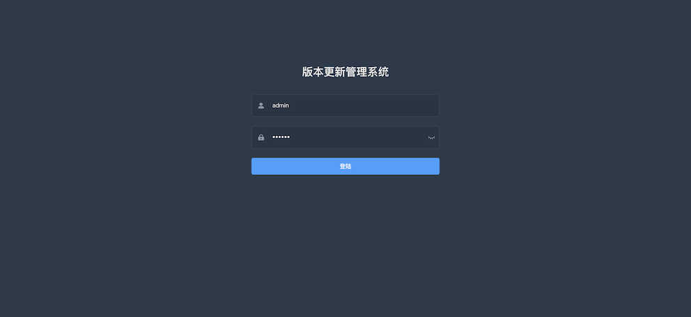
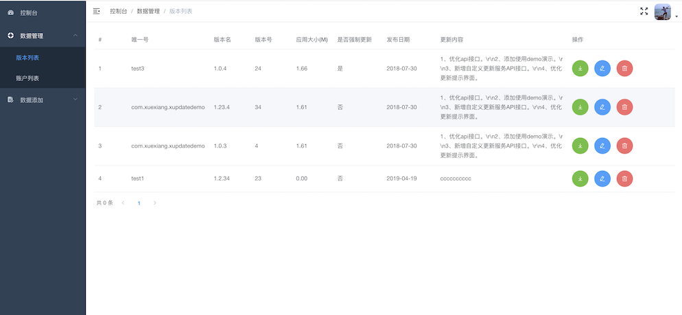
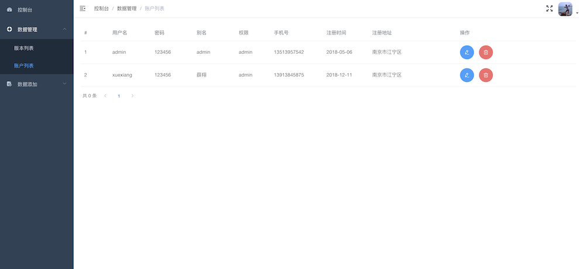
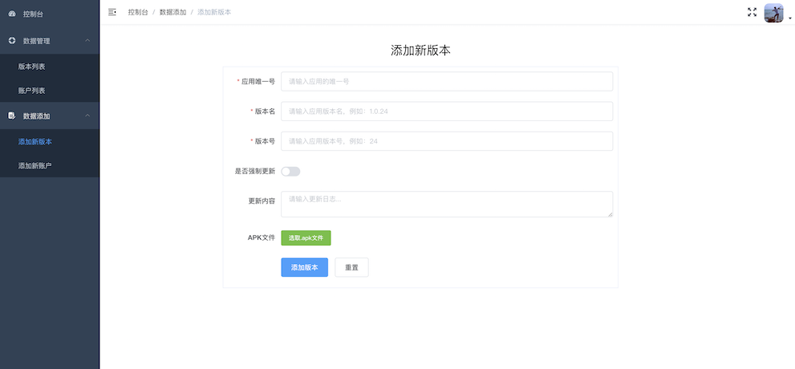
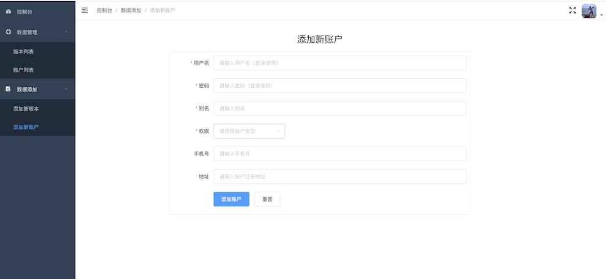
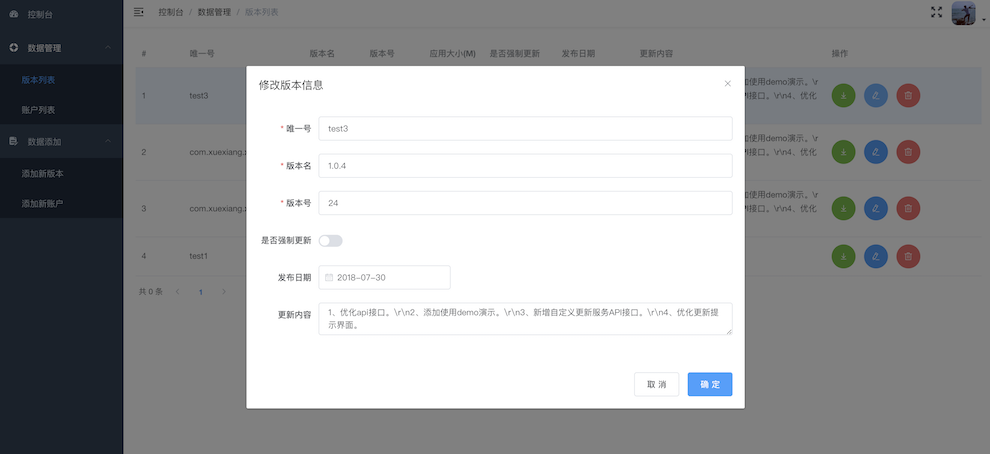

# xupdate-management

> 使用Vue.js编写的版本更新管理后台，为XUpdate提供版本更新管理

## 运行

``` bash
# install dependencies
npm install

# serve for development with hot reload at http://localhost:8088/mock
npm run dev

# preview for production at http://localhost:1111
npm run preview

# package
npm run build:prod

```

## 界面预览













## 关联链接

* [XUpdate 一个轻量级、高可用性的Android版本更新框架](https://github.com/xuexiangjys/XUpdate)

* [为XUpdate提供后台API服务](https://github.com/xuexiangjys/XUpdateService)